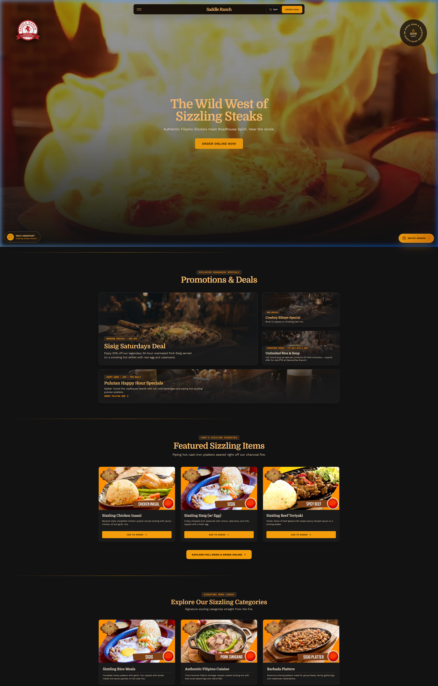
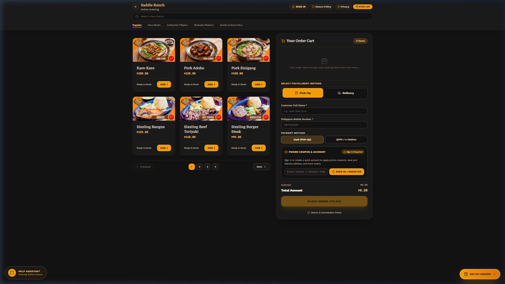
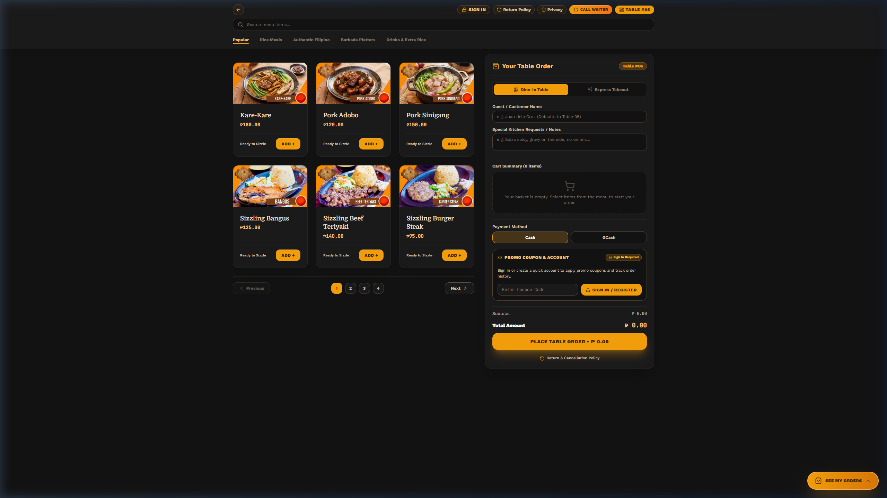
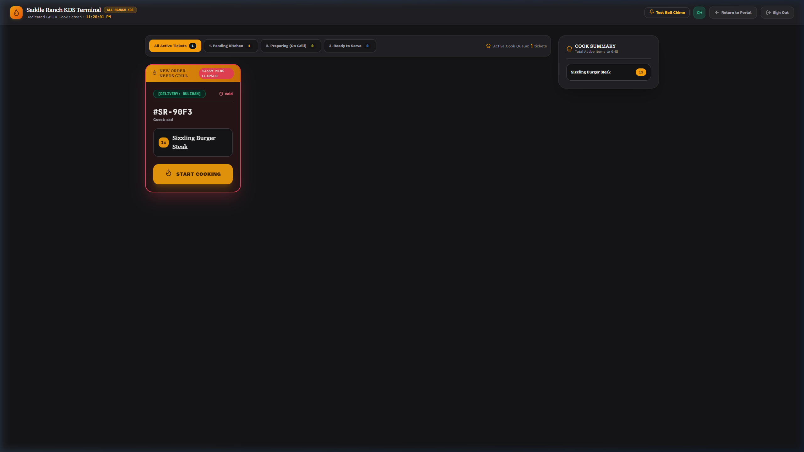
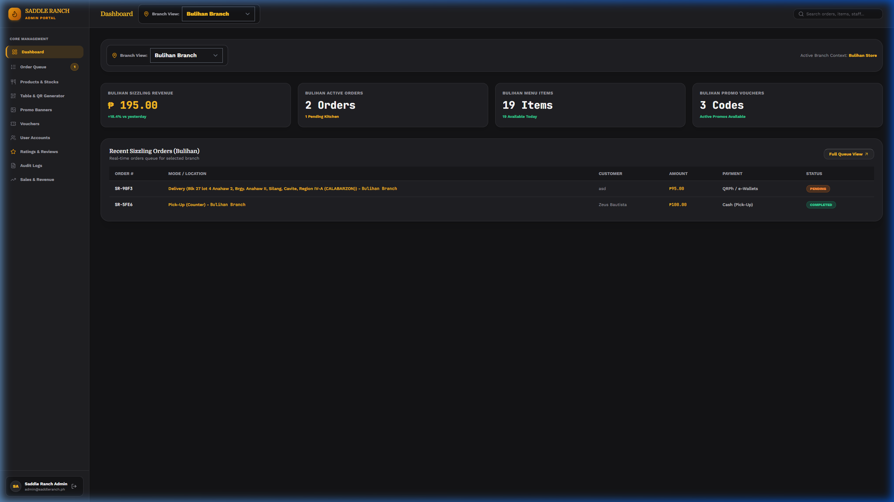

<div align="center">

  

  # 🥩 Saddle Ranch Roadhouse — Web Application

  **Enterprise Full-Stack Restaurant Ordering, In-House QR Dining, KDS & Management Ecosystem**

  [](https://laravel.com)
  [](https://react.dev)
  [](https://www.typescriptlang.org/)
  [](https://inertiajs.com)
  [](https://tailwindcss.com)
  [](LICENSE)

  <p align="center">
    <a href="#-client-project-showcase">Client Showcase</a> •
    <a href="#-system-overview--core-modules">System Overview</a> •
    <a href="#-ui-gallery--screenshots">UI Gallery</a> •
    <a href="#-technology-stack">Tech Stack</a> •
    <a href="#-getting-started--local-setup">Getting Started</a> •
    <a href="#-test-accounts--access-credentials">Test Credentials</a> •
    <a href="#-mobile-wi-fi-qr-testing-guide">QR Testing Guide</a>
  </p>

</div>

---

## 💼 Client Project Showcase

> [!IMPORTANT]
> **Production Client System Showcase**  
> This project was custom-engineered for **Saddle Ranch Roadhouse** (a premier steakhouse and sizzling grill brand with branches in Silang, Bulihan, and Dasmariñas, Cavite, Philippines).  
>
> While most of my enterprise and commercial software projects remain strictly confidential under Non-Disclosure Agreements (NDAs), **Saddle Ranch Roadhouse is an authorized public portfolio showcase** demonstrating end-to-end full-stack software architecture, scalable database design, real-time kitchen operations, and high-conversion restaurant UX.

---

## 📖 System Overview & Core Modules

Saddle Ranch Web is a multi-tier restaurant management and e-commerce platform built to seamlessly connect customers, dining tables, line-cooks, and business managers under a single reactive system.

```
                                  ┌──────────────────────────────┐
                                  │   SADDLE RANCH ROADHOUSE     │
                                  └──────────────┬───────────────┘
                                                 │
                  ┌──────────────────────────────┼──────────────────────────────┐
                  ▼                              ▼                              ▼
      ┌────────────────────────┐    ┌────────────────────────┐    ┌────────────────────────┐
      │   CUSTOMER WEB APP     │    │   IN-HOUSE QR TABLES   │    │  COMPANION MOBILE APP  │
      │ • Pick-Up & Delivery   │    │ • Dynamic ?table=XX    │    │ • Flutter 1:1 Parity   │
      │ • Bulihan Fee Engine   │    │ • "Call Waiter" Chime  │    │ • Sanctum Token Auth   │
      │ • QRPh / GCash Pay     │    │ • Express Takeout      │    │ • Email OTP (Brevo)    │
      └───────────┬────────────┘    └───────────┬────────────┘    └───────────┬────────────┘
                  │                             │                             │
                  └──────────────────────┬──────┴─────────────────────────────┘
                                         ▼
                 ┌───────────────────────────────────────────────┐
                 │       LARAVEL 11 + INERTIA + SANCTUM          │
                 │  Atomic Transactions • Stock Dec • Auditing   │
                 └──────────────┬────────────────┬───────────────┘
                                │                │
                ┌───────────────┴────┐      ┌────┴───────────────┐
                ▼                    ▼      ▼                    ▼
      ┌──────────────────┐ ┌──────────────────┐ ┌──────────────────┐
      │  KITCHEN KDS     │ │ ADMIN DASHBOARD  │ │ DATABASE & AUDIT │
      │ • Live Order Pop │ │ • Revenue Analytics│ • SQLite / MySQL │
      │ • Cook Timers    │ │ • WebP Asset Upload│ • 100% Trace Log │
      │ • Status Stages  │ │ • QR Generator   │ │ • Role Security  │
      └──────────────────┘ └──────────────────┘ └──────────────────┘
```

---

### 1️⃣ Customer Online Ordering & Delivery Engine (`/order`)
- **Dynamic Categorized Menu**: Sizzling Rice Meals, Authentic Filipino Cuisines, Family Barkada Platters, and Specialty Drinks.
- **Smart Delivery Cascading**: Structured location dropdown for Cavite municipalities with special ₱0.00 delivery calculations for the **Bulihan** cluster.
- **QRPh & Digital Payments**: Integrated QRPh and e-Wallet payment flow (GCash, Maya, ShopeePay, Cards) with automated order confirmation.
- **Live Order Tracker**: Customer lookup by Order Number or Phone Number with real-time status progression.
- **AI Concierge Chatbot**: Context-aware assistant providing menu recommendations, store hours, and dietary answers.
- **Customer Ratings & Review Engine**: Real-time review submissions with built-in bilingual profanity and URL moderation filtering.

---

### 2️⃣ Contactless In-House QR Table Dining (`/dine-in?table=05`)
- **Dynamic Table Routing**: Direct table initialization via URL parameter (e.g. `?table=05`).
- **Instant "Call Waiter" Service**: Digital chime alert sent directly to staff terminals with active acknowledgment status tracking.
- **Dine-In & Express Takeout Modes**: Flexible ordering options for patrons dining inside the roadhouse.

---

### 3️⃣ Real-Time Kitchen Display System (KDS) (`/employee/kitchen`)
- **Live Order Polling Queue**: Auto-refreshing order cards displaying elapsed preparation timers and table origins.
- **Audio Bell Chimes**: Sound alert notifications triggered whenever new orders are dispatched to the kitchen.
- **Color-Coded Status Lifecycle**:
  $$\text{Pending Kitchen} \longrightarrow \text{Preparing (On Grill)} \longrightarrow \text{Ready to Serve} \longrightarrow \text{Completed}$$
- **Active Cook Summary**: Aggregated item quantities to give chefs an instant snapshot of total steaks, inasal, and sizzlers on the grill.

---

### 4️⃣ Comprehensive Admin Operations Portal (`/admin/dashboard`)
- **Executive Sales Analytics**: Real-time revenue metrics, daily order volumes, and average ticket size.
- **Menu & Stock Management**: Create, update, toggle availability, and upload WebP imagery with automatic inventory decrementing.
- **Table QR Code Generator**: Generate printable QR codes mapped to custom domains or local Wi-Fi IP addresses for all tables.
- **Promo Vouchers & Banners**: Configure percentage or fixed discounts, minimum spend thresholds, expiration dates, and 1-time usage limits.
- **Staff Access Control & Audit Logs**: Role-based access control (`admin`, `employee`) and immutable system audit logging.

---

### 5️⃣ RESTful Mobile API for Flutter Companion App (`/api/v1/...`)
- Complete REST API layer supporting 1:1 parity with the mobile application.
- **Sanctum Token Authentication** with 6-digit email OTP verification via **Brevo SMTP**.

---

## 🖼️ UI Gallery & Screenshots

<div align="center">

### 🌟 1. Customer Landing Page & Hero Showcase
*Immersive western roadhouse aesthetic, video integration, deals slider, and verified customer reviews.*



---

### 🛒 2. Remote Online Ordering & Checkout
*Categorized catalog, responsive cart slider, Cavite delivery cascading, and payment options.*



---

### 📱 3. In-House QR Table Ordering (`Table #05`)
*Contactless table-side dining interface with instant "Call Waiter" chime functionality.*



---

### 👨‍🍳 4. Real-Time Kitchen Display System (KDS)
*Line-cook order queue with live cook timers, audio notifications, and active grill summaries.*



---

### 📊 5. Executive Admin Dashboard & Business Hub
*Real-time branch revenue analytics, order processing queue, and system management.*



</div>

---

## 🛠️ Technology Stack

| Layer | Technologies |
| :--- | :--- |
| **Backend Framework** | [Laravel 11.x](https://laravel.com) (PHP 8.2+) |
| **Frontend Framework** | [React 18.x](https://react.dev) with [TypeScript](https://www.typescriptlang.org/) |
| **Monolith Bridge** | [Inertia.js 2.x](https://inertiajs.com) (Server-driven Single Page Application) |
| **Styling & Design** | [Tailwind CSS v4.0](https://tailwindcss.com), [Shadcn UI](https://ui.shadcn.com), Lucide Icons |
| **Animations & Effects** | [GSAP 3.x](https://greensock.com/gsap/), tw-animate-css |
| **Database & ORM** | [SQLite](https://www.sqlite.org/) (Development & Testing) / [MySQL](https://www.mysql.com/) (Production) via Eloquent ORM |
| **Authentication & APIs** | [Laravel Sanctum](https://laravel.com/docs/sanctum) & Session Auth |
| **Email & OTP Delivery** | [Brevo (Sendinblue) SMTP](https://www.brevo.com/) & Symfony Mailer |
| **Testing Suite** | [PHPUnit 11.x](https://phpunit.de/) (418+ Automated Feature & Unit Assertions) |

---

## 🚀 Getting Started & Local Setup

### 1. Prerequisites
Ensure the following tools are installed on your environment:
- [Node.js](https://nodejs.org/) (v18.x or v20.x+)
- [PHP](https://www.php.net/) (v8.2+) with `pdo_sqlite`, `mbstring`, `openssl`, `curl` extensions enabled
- [Composer](https://getcomposer.org/)

---

### 2. Installation & Environment Configuration

```bash
# 1. Clone the repository
git clone https://github.com/kidlatpogi/Saddle-Ranch-Web.git
cd Saddle-Ranch-Web/saddle-ranch-web

# 2. Install backend dependencies
composer install

# 3. Install frontend dependencies
npm install --legacy-peer-deps

# 4. Configure environment
cp .env.example .env
php artisan key:generate

# 5. Run database migrations & seed sample menu / test users
php artisan migrate:fresh --seed
```

---

### 3. Build & Run the Application

#### Option A: Production Build Mode (Recommended for testing)
```bash
# Compile optimized production assets
npm run build

# Start the Laravel backend server
php artisan serve
```
> Open your browser to **[http://127.0.0.1:8000](http://127.0.0.1:8000)**.

#### Option B: Development Mode (Hot Module Replacement)
Run both processes in separate terminal windows:
```bash
# Terminal 1: Vite Hot Module Replacement
npm run dev

# Terminal 2: Laravel Backend Server
php artisan serve
```

---

## 🔑 Test Accounts & Access Credentials

The database seeder automatically creates the following default test accounts:

| Role | Email Address | Default Password | Access URL |
| :--- | :--- | :--- | :--- |
| **👑 System Administrator** | `admin@saddleranch.ph` | `password` | `http://127.0.0.1:8000/login` |
| **💵 Cashier / Staff (Bulihan)** | `cashier.bulihan@saddleranch.ph` | `password` | `http://127.0.0.1:8000/login` |
| **👨‍🍳 Head Chef / Kitchen KDS** | `kitchen.bulihan@saddleranch.ph` | `password` | `http://127.0.0.1:8000/employee/kitchen` |

---

## 📱 Mobile Wi-Fi QR Testing Guide

To test real smartphone QR code scanning (iPhone / Android) against your local machine:

1. **Connect Devices to Same Wi-Fi**: Connect both your host PC and testing phones to the same local Wi-Fi router or mobile hotspot.
2. **Find Your Host IPv4 Address**:
   ```powershell
   ipconfig
   ```
   *(e.g., `192.168.1.15`)*
3. **Start the Laravel Server on `0.0.0.0`**:
   ```bash
   php artisan serve --host=0.0.0.0 --port=8000
   ```
4. **Open the QR Code Generator**: Log into `http://YOUR_LOCAL_IP:8000/admin/qr-generator` on your PC.
5. **Scan Table QR Code with Phone**: Point your phone camera at **Table 05** or **Table 12** to open the live dining menu and test placing orders or calling the waiter!

---

## 🧪 Automated Testing

The codebase includes an extensive automated test suite covering all authentication flows, atomic checkout transactions, stock deductions, KDS state transitions, and responsive endpoints:

```bash
php artisan test
```

```
   PASS  Tests\Unit\ExampleTest
   PASS  Tests\Feature\AdminProductWebpUploadTest
   PASS  Tests\Feature\Auth\AuthenticationTest
   PASS  Tests\Feature\Auth\EmailVerificationTest
   PASS  Tests\Feature\Auth\PasswordResetTest
   PASS  Tests\Feature\BrowserAndUiClickThroughTest
   PASS  Tests\Feature\OrderCheckoutTest
   PASS  Tests\Feature\RealWorldClientReadinessTest
   PASS  Tests\Feature\SaddleRanchSystemTest
   PASS  Tests\Feature\UiUxTypographyResponsivenessTest

   Tests:  418 passed assertions
```

---

## 📄 License & Confidentiality Notice

```
PROPRIETARY & CONFIDENTIAL — ALL RIGHTS RESERVED
Copyright (c) 2026 Saddle Ranch Roadhouse.

Unauthorized copying, cloning, reverse engineering, redistribution, or commercial use
of this codebase or any part thereof is strictly prohibited without explicit written permission.
```
