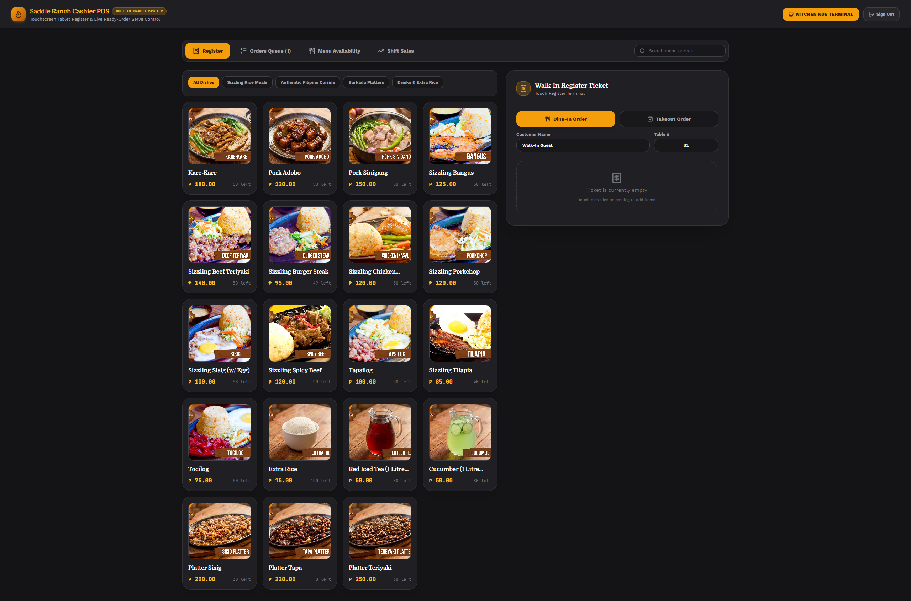
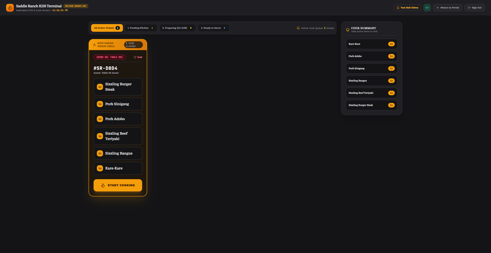
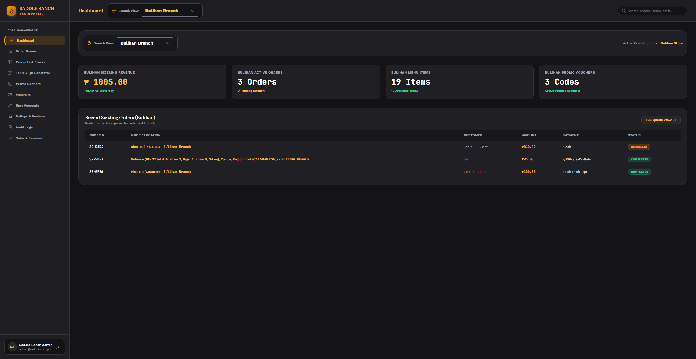

<div align="center">

  

  # Saddle Ranch Roadhouse Web Application

  **Enterprise Restaurant Management Ecosystem with Real-Time Kitchen Display, Point-of-Sale, QR Table Dining, and Cascading Delivery Logistics**

  <p align="center">
    
    
    
    
    
    
    
  </p>

  <p align="center">
    <a href="#client-showcase--confidentiality-disclosure">Client Showcase</a> &bull;
    <a href="#system-architecture">System Architecture</a> &bull;
    <a href="#core-operational-modules">Core Modules</a> &bull;
    <a href="#visual-interface-gallery">Visual Gallery</a> &bull;
    <a href="#technical-specifications">Technical Specs</a> &bull;
    <a href="#contributors--acknowledgments">Contributors</a> &bull;
    <a href="#proprietary-license--terms">License</a>
  </p>

</div>

---

## Client Showcase & Confidentiality Disclosure

This enterprise restaurant platform was designed and engineered for **Saddle Ranch Roadhouse**, a multi-branch steakhouse and sizzling grill chain operating across Silang, Bulihan, and Dasmari&ntilde;as in Cavite, Philippines.

### Portfolio Showcase Authorization
While several enterprise client platforms engineered under professional contract remain strictly confidential under Non-Disclosure Agreements (NDAs), **Saddle Ranch Roadhouse has authorized this public portfolio exhibition**. This repository serves as a technical demonstration of full-stack system design, real-time kitchen orchestration, atomic transaction handling, and restaurant e-commerce architecture.

> **Confidentiality & Compliance Notice**: The client has authorized public review of system architecture, technical documentation, and visual interface flows. In compliance with client data privacy and intellectual property agreements, proprietary database contents, operational passwords, API credentials, customer PII, and production server secrets remain strictly confidential and are not published for public execution.

---

## System Architecture

The Saddle Ranch ecosystem unifies customer e-commerce, table-side contactless ordering, in-store cashier POS terminals, line-cook kitchen display systems, and business intelligence into an event-driven monolith.

```
                              +---------------------------------------------+
                              |         SADDLE RANCH ROADHOUSE CORE         |
                              +----------------------+----------------------+
                                                     |
                     +-------------------------------+-------------------------------+
                     |                               |                               |
                     v                               v                               v
       +---------------------------+   +---------------------------+   +---------------------------+
       |   CUSTOMER WEB COMMERCE   |   |   IN-HOUSE QR ORDERING    |   |   MOBILE COMPANION APPS   |
       | - Distance & Fee Engine   |   | - Contactless Table URLs  |   | - Flutter 1:1 REST Parity |
       | - Cavite Cascade Selector |   | - Staff Waiter Call Chime |   | - Sanctum Token Issuance  |
       | - QRPh Digital Checkout   |   | - Express Takeout Mode    |   | - Brevo Email OTP Auth    |
       +-------------+-------------+   +-------------+-------------+   +-------------+-------------+
                     |                               |                               |
                     +-------------------------------+-------------------------------+
                                                     |
                                                     v
                                 +---------------------------------------+
                                 |     LARAVEL 11 + INERTIA.JS + DB      |
                                 |  Atomic Locking * Automated Stock Dec |
                                 |  Regulatory Discounts * Audit Trails  |
                                 +-------------------+-------------------+
                                                     |
                         +---------------------------+---------------------------+
                         |                           |                           |
                         v                           v                           v
           +---------------------------+   +---------------------------+   +---------------------------+
           |   KITCHEN DISPLAY (KDS)   |   |   POINT-OF-SALE (POS)     |   |   EXECUTIVE ADMIN HUB     |
           | - Live Ticket Pipeline    |   | - Walk-In Cashier Entry   |   | - Sales Revenue Analytics |
           | - Visual Cook Timers      |   | - Senior/PWD 20% Discount |   | - WebP Image Processing   |
           | - Web Audio Kitchen Bell  |   | - Instant DB Synchronization | - QR Generator Engine      |
           | - Manager Security Void   |   | - Thermal Receipt Builder |   | - Immutable Event Logs    |
           +---------------------------+   +---------------------------+   +---------------------------+
```

---

## Core Operational Modules

### 1. Customer E-Commerce & Delivery Engine
- **Hierarchical Catalog Navigation**: Sizzling Rice Meals, Authentic Filipino Cuisines, Barkada Platters, and Specialty Drinks.
- **Cascading Geographical Selector**: Municipality and barangay cascading selector for Cavite province, with dedicated fee waiver logic for the Bulihan branch cluster.
- **Integrated Digital Payments**: Support for QRPh e-Wallets (GCash, Maya, ShopeePay) and Cash on Delivery with payment status verification.
- **Self-Service Order Tracker**: Real-time order lookup by tracking number or mobile number with live stage progression.
- **Embedded AI Concierge**: Real-time virtual assistant providing contextual menu guidance and restaurant policy answers.
- **Automated Review Moderation**: Live customer rating submission with bilingual profanity and URL moderation filters.

---

### 2. In-House Contactless QR Table Dining
- **Dynamic Table Routing**: Parameterized session initialization (`?table=05`) enabling table-side ordering.
- **Staff Service Alerts**: "Call Waiter" digital chime integration with real-time staff acknowledgment status tracking.
- **Flexible In-Store Fulfillment**: Seamless switching between Table Dine-In and Express Counter Takeout modes.

---

### 3. Point-of-Sale (POS) Cashier Terminal
- **Walk-In Order Processing**: Direct cashier order entry supporting instant table assignment or counter pick-up.
- **Regulatory Discount Engine**: Senior Citizen and PWD 20% discount calculations with automated VAT breakdown.
- **Database & KDS Synchronization**: Real-time atomic persistence ensuring walk-in orders instantly propagate to kitchen screens and decrement inventory.
- **Thermal Receipt Generation**: Structured digital receipt formatting ready for thermal printing and transaction auditing.

---

### 4. Real-Time Kitchen Display System (KDS)
- **Live Order Polling Queue**: Auto-refreshing kitchen interface organized chronologically by submission timestamp.
- **Visual Status Progression**:
  $$\text{Pending Kitchen} \longrightarrow \text{Preparing (On Grill)} \longrightarrow \text{Ready to Serve} \longrightarrow \text{Completed}$$
- **Auditory Notifications**: Dedicated kitchen chime alerts signaling incoming orders.
- **Active Cook Summary**: Aggregated item quantities providing kitchen staff with real-time counts of items currently on the grill.
- **Security Void Protection**: Manager password authorization required to void or cancel active orders with automatic inventory restoration.

---

### 5. Executive Administration & Operations Portal
- **Revenue Analytics**: Real-time sales volume tracking, branch revenue comparisons, and average ticket size metrics.
- **Catalog & Inventory Control**: Product CRUD operations with WebP image processing and branch-specific stock thresholds.
- **Table QR Code Generator**: Dynamic generation of printable table QR codes configured for local network or domain routing.
- **Promotional Campaigns**: Custom voucher rules (percentage, fixed amount, minimum spend, expiry date, single-use limits) and marketing banner controls.
- **Security & Audit Logging**: Role-based access control (`admin`, `employee`, `cashier`, `kitchen`) and immutable event audit logs.

---

### 6. Mobile Companion REST APIs
- Full RESTful API layer providing 1:1 functional parity with mobile client applications.
- **Sanctum Authentication**: Secure bearer token issuance with 6-digit email OTP verification via Brevo SMTP.

---

## Visual Interface Gallery

<div align="center">

### Customer Landing Page & Brand Experience
*Immersive western roadhouse aesthetic, video showcase, promotional specials, and verified customer reviews.*


---

### Remote Online Ordering & Checkout
*Categorized catalog, responsive cart slider, Cavite delivery cascading, and payment options.*


---

### In-House QR Table Dining
*Contactless table-side dining interface with instant "Call Waiter" service chime.*


---

### Cashier Point-of-Sale (POS) Terminal
*Walk-in ticket builder, quick-cash presets, Senior/PWD discount calculations, and thermal receipt generation.*



---

### Real-Time Kitchen Display System (KDS)
*Line-cook order queue with preparation timers, audio alerts, and active grill summaries.*



---

### Executive Admin Dashboard
*Real-time branch revenue analytics, order queue monitoring, catalog management, and audit logs.*



</div>

---

## Technical Specifications

| Layer | Component | Description |
| :--- | :--- | :--- |
| **Backend Framework** | Laravel 11.x | PHP 8.2+, Eloquent ORM, Database Migrations & Seeders |
| **Frontend Framework** | React 18.x + TypeScript | Type-safe Single Page Application via Inertia.js 2.x |
| **Design System** | Tailwind CSS v4.0 | Shadcn UI primitives, Lucide Icons, Custom Design Tokens |
| **Animation Engine** | GSAP 3.x | Fluid UI transitions and micro-interactions |
| **Database Engines** | SQLite / MySQL | ACID-compliant relational schemas with atomic transaction locks |
| **Authentication** | Laravel Sanctum & Session | Dual session-based web auth and Sanctum token API auth |
| **Email Infrastructure** | Brevo SMTP | Automated 6-digit OTP verification and transactional mailing |
| **Automated Testing** | PHPUnit 11.x | Comprehensive feature and unit test coverage (429+ assertions) |

---

## Contributors & Acknowledgments

- **Lead Engineer & System Architect**: System design, end-to-end architecture, database schema, POS/KDS engine, UI design system, and the finalized implementation of the Brevo SMTP Email OTP verification infrastructure.
- **Authentication & Security Contributor**: Special credit and acknowledgment to **[crazysen](https://github.com/crazysen)**, who utilized Cursor AI to initiate and lay the groundwork for the Email OTP verification module, as well as contributing to the Forgot Password and Reset Password workflows.

---

## Proprietary License & Terms

```
PROPRIETARY & CONFIDENTIAL — ALL RIGHTS RESERVED
Copyright (c) 2026 Saddle Ranch Roadhouse.

This repository is presented strictly for professional portfolio review and architectural evaluation.
Unauthorized copying, duplication, reproduction, reverse engineering, redistribution, or commercial
exploitation of this codebase, design assets, or proprietary system logic is strictly prohibited.
```
